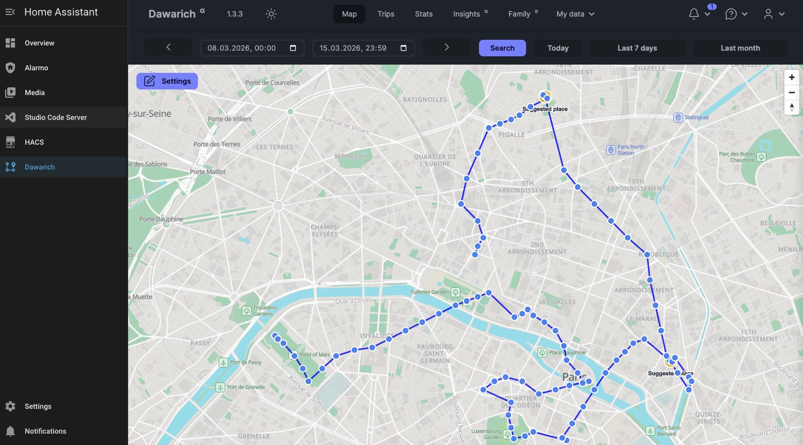

# Dawarich Home Assistant App

**Current Dawarich version: 1.6.1** ([release notes](https://github.com/Freika/dawarich/releases/tag/1.6.1))

[![HA App][ha-app-badge]][ha-app-link]

[](https://my.home-assistant.io/redirect/supervisor_add_addon_repository/?repository_url=https://github.com/thomdev-j/homeassistant-app-dawarich)



**This app runs a full [Dawarich](https://github.com/Freika/dawarich) instance directly on your Home Assistant OS device** — a self-hosted alternative to Google Timeline. No separate server or Docker Compose setup needed. Just install, and you have location tracking with full control of your data.

> **Note:** This app requires [Home Assistant OS](https://www.home-assistant.io/installation/) (HAOS), which provides the app system. Home Assistant Container or Core installations cannot run apps.

## Features

- **Zero setup** — PostgreSQL, Redis, and all dependencies bundled in a single app container
- **Automatic HA device tracking** — subscribes to real-time state changes and pushes GPS data to Dawarich instantly
- **Multi-device, multi-user** — assign devices to separate Dawarich users per household member via app config
- **HA Ingress** — access the UI securely through the Home Assistant sidebar, no extra ports needed
- **Full backups** — integrates with HA's backup system including automatic PostgreSQL dumps

## Quick Start

### 1. Install

[](https://my.home-assistant.io/redirect/supervisor_add_addon_repository/?repository_url=https://github.com/thomdev-j/homeassistant-addon-dawarich)

Or manually add this repository URL to your Home Assistant app store:

```
https://github.com/thomdev-j/homeassistant-app-dawarich
```

**Settings** → **Apps** → **+ Install App** → **Repositories** → paste the URL → **Add**

Then find **Dawarich** in the store and click **Install**. The image is roughly 1 GB, so the initial download may take a while depending on your internet connection.

### 2. Configure

In the app configuration tab, set at minimum:

| Option | What to set |
|---|---|
| `admin_email` | Your login email (default: `admin@dawarich.local`) |
| `admin_password` | Your login password (**change from `changeme`!**) |
| `time_zone` | Your timezone, e.g. `America/New_York`, `Europe/Berlin` |

### 3. Start

Click **Start**. The first boot initializes the database and compiles frontend assets, which takes a bit longer. Subsequent starts are fast (under 15 seconds, even on a Raspberry Pi). Watch the **Log** tab for progress.

### 4. Open

Click **Open Web UI** in the sidebar, or navigate to `http://<your-ha-ip>:3000`. Log in with the email and password you configured.

## Automatic Location Tracking

The app subscribes to Home Assistant's real-time event stream and automatically sends GPS data to Dawarich the instant your device reports a new position. No phone app needed — if Home Assistant already knows your location, Dawarich will too.

### Single user

Track one or more devices under the admin account:

```yaml
ha_tracked_entities: "device_tracker.my_phone"
```

Multiple devices for the same user:

```yaml
ha_tracked_entities: "device_tracker.my_phone, device_tracker.my_tablet"
```

### Multiple household members

Add a `:Name` suffix to create a separate Dawarich user per person:

```yaml
ha_tracked_entities: "device_tracker.my_phone:Alice, device_tracker.partner_phone:Bob"
```

This automatically creates:
- `alice@dawarich.local` (password: `password`)
- `bob@dawarich.local` (password: `password`)

Each device's location data goes to its own user. Users can change their password after first login via the Dawarich settings page. Once multiple users exist, you can use Dawarich's built-in **Family** feature to see everyone on a shared map with different colors.

Two devices for the same person share one user — just use the same name:

```yaml
ha_tracked_entities: "device_tracker.alices_phone:Alice, device_tracker.alices_watch:Alice"
```

You can mix named and unnamed entities — unnamed ones use the admin account:

```yaml
ha_tracked_entities: "device_tracker.my_phone:Alice, device_tracker.tablet"
```

### Real-time tracking

The tracker subscribes to Home Assistant's Server-Sent Events (SSE) stream for real-time `state_changed` events. When your phone pushes a new GPS position to HA, the tracker receives it instantly and forwards it to Dawarich — no polling delay, no gaps.

Check the app logs for `connected — receiving real-time state changes` to confirm it's working.

Duplicate locations (same lat/lon) are always skipped. Additionally, positions closer than `ha_min_distance` meters (default: 10m) to the last recorded point are filtered out — this prevents GPS drift from generating spurious data points when your phone is stationary.

## All Configuration Options

### General

| Option | Default | Description |
|---|---|---|
| `admin_email` | `admin@dawarich.local` | Email address used to log into Dawarich as admin. |
| `admin_password` | `changeme` | Password for the admin account. Only used on first creation — changing this later won't update an existing account. Change your password through the Dawarich UI instead. |
| `time_zone` | `Etc/UTC` | Timezone for displaying dates and times in the UI. Uses standard [tz database names](https://en.wikipedia.org/wiki/List_of_tz_database_time_zones) (e.g. `America/New_York`, `Europe/Berlin`, `Asia/Tokyo`). |
| `database_password` | `dawarich` | Password for the internal PostgreSQL database. Only relevant inside the container — not exposed externally. Changing this after first setup requires manual database migration. |
| `application_hosts` | `homeassistant.local,localhost` | Comma-separated list of hostnames/IPs that Rails accepts requests from. Only needed when accessing Dawarich directly on port 3000. Ingress access (via the sidebar) works regardless of this setting. Add your HA IP if you get "blocked host" errors, e.g. `homeassistant.local,localhost,192.168.1.100`. |
| `background_processing_concurrency` | `5` | Number of Sidekiq worker threads for background jobs (imports, reverse geocoding, stats). Range: 1-20. Lower this on resource-constrained devices like Raspberry Pi 3 (`2`-`3`). Increase for faster import processing on powerful hardware. |

### Device Tracking

| Option | Default | Description |
|---|---|---|
| `ha_tracked_entities` | _(empty)_ | Comma-separated list of `device_tracker.*` entity IDs to track. Leave empty to disable automatic tracking. Optionally add a `:Name` suffix to assign a device to a specific user (see [Multi-user](#multiple-household-members) above). Find your entity IDs in HA under **Developer Tools → States**. |
| `ha_min_distance` | `10` | Minimum distance in meters a device must move before the new position is recorded (0-1000). Filters GPS drift when stationary — typical drift is 3-15m. Set to `0` to disable and record every position change. |

### Reverse Geocoding

Reverse geocoding converts GPS coordinates into human-readable place names (street, city, country). Disabled by default — just set `reverse_geocoding` to `true` to use the public Photon instance (no key needed).

Optionally, you can use a different provider instead:

- **Photon (public)** — the default (`photon.komoot.io`) works out of the box, no key needed
- **Photon (self-hosted)** — run your own [Photon](https://github.com/komoot/photon) instance and set `photon_api_host` to its URL
- **Dawarich Patreon** — supporters get access to `photon.dawarich.app` (set as `photon_api_host`, plus `photon_api_key`)
- **Geoapify** — sign up at [geoapify.com](https://www.geoapify.com/) for a free API key, then set `geoapify_api_key`

The app tests the geocoding API on startup and logs whether it's reachable.

| Option | Default | Description |
|---|---|---|
| `reverse_geocoding` | `false` | Enable reverse geocoding to convert coordinates into place names. Requires a working provider (see above). |
| `photon_api_host` | `https://photon.komoot.io` | URL of the Photon geocoding service. Works with the public instance, a self-hosted instance, or Dawarich Patreon (`photon.dawarich.app`). |
| `photon_api_key` | _(empty)_ | API key for Photon. Required for Dawarich Patreon supporters using `photon.dawarich.app`. |
| `geoapify_api_key` | _(empty)_ | If set, Dawarich uses [Geoapify](https://www.geoapify.com/) instead of Photon. Free tier available. |

## Data & Backups

All data persists across app restarts and updates under `/data/`:

| Path | Contents |
|---|---|
| `/data/postgres/` | PostgreSQL database |
| `/data/redis/` | Redis persistence |
| `/data/dawarich/storage/` | User uploads and exports |
| `/data/dawarich/secret_key_base` | Auto-generated Rails secret (sessions are invalidated if deleted) |

**Backups** work with Home Assistant's built-in backup system. Before a backup, the app dumps PostgreSQL to SQL so it can be cleanly restored. Raw database files are excluded — only the portable SQL dump is included.

## Security

- PostgreSQL and Redis bind to `localhost` only — not exposed outside the container
- The admin user is the only account with access to the Settings → Users page
- Home Assistant ingress provides authenticated access without exposing port 3000
- If you don't use ingress, port 3000 is available on your local network

## Hardware Requirements

The app runs PostgreSQL, Redis, Sidekiq, and a Rails app — it needs a reasonable amount of RAM. CPU usage is negligible (< 1% idle).

| Device | RAM | Status |
|---|---|---|
| Raspberry Pi 5 (8 GB) | ~800 MB (~10%) | Recommended |
| Raspberry Pi 5 (4 GB) | ~800 MB (~20%) | Works well |
| Raspberry Pi 4 (8 GB) | ~800 MB (~10%) | Works well |
| Raspberry Pi 4 (4 GB) | ~800 MB (~20%) | Works, but leaves less room for other apps |
| Raspberry Pi 4 (2 GB) | ~800 MB (~40%) | Not recommended — tight with HA + other apps |
| Home Assistant Green (4 GB) | ~800 MB (~20%) | Works well |

**Disk space:** The app image is roughly 1 GB. Allow additional space for the PostgreSQL database, which grows with your location history.

## FAQ

### Do I need the Dawarich phone app?

No. The app subscribes to HA's real-time event stream and tracks your devices automatically. You can optionally use the Dawarich phone app or OwnTracks alongside it — see the [Dawarich docs](https://dawarich.app/) for details.

### Can I import existing location history?

Yes. Dawarich supports importing from Google Takeout, OwnTracks, GPX, and more via its **My Data → Import** page.

### I get a blank page or "blocked host" error

Add your Home Assistant's hostname or IP to `application_hosts`. For example: `homeassistant.local,localhost,192.168.1.100`. This is only needed when accessing port 3000 directly — ingress access (via the sidebar) works without it.

### Can I change the admin password after first setup?

Yes, log into Dawarich and change it through the UI (click your avatar → account settings). Changing `admin_password` in the app config only affects initial user creation — it won't reset an existing password.

### How do I give another user admin access?

Log in as admin, go to **Settings → Users**, and promote the user from there.

### The map is empty after setup

Location data needs time to accumulate. If using HA tracking, check the app logs for `HA Tracker: pushed` messages to confirm data is flowing. Verify your device tracker entities have GPS coordinates in **Developer Tools → States**.

### How do I find my device tracker entity IDs?

In Home Assistant, go to **Developer Tools → States** and filter for `device_tracker.`. Entities with `latitude` and `longitude` attributes will work with this app.

### How do I reset everything and start fresh?

Stop the app, delete the `/data/` directory contents via SSH or the file editor app, and restart. The app will reinitialize from scratch.

### What architectures are supported?

`amd64` (Intel/AMD) and `aarch64` (Raspberry Pi 4/5, Apple Silicon via HA OS).

## License

This app is licensed under the [GNU Affero General Public License v3.0](LICENSE).

This app builds on top of the [Dawarich](https://github.com/Freika/dawarich) Docker image (`freikin/dawarich`), copyright [Freika](https://github.com/Freika), also licensed under AGPL-3.0.

## Links

- [Dawarich](https://github.com/Freika/dawarich) — upstream project
- [Dawarich Documentation](https://dawarich.app/) — full feature documentation
- [Report an issue](https://github.com/thomdev-j/homeassistant-addon-dawarich/issues)

[ha-app-badge]: https://img.shields.io/badge/Home%20Assistant-App-blue?logo=homeassistant
[ha-app-link]: https://github.com/thomdev-j/homeassistant-app-dawarich
