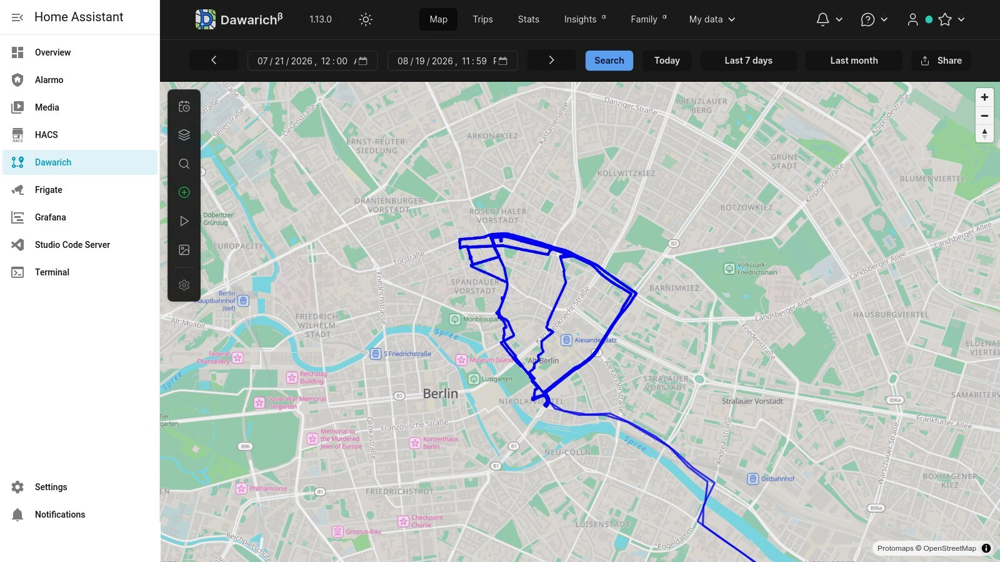

# Dawarich Home Assistant App

**Current Dawarich version: 1.12.2** ([release notes](https://github.com/Freika/dawarich/releases/tag/1.12.2))

[![HA App][ha-app-badge]][ha-app-link]

[](https://my.home-assistant.io/redirect/supervisor_add_addon_repository/?repository_url=https://github.com/thomdev-j/homeassistant-app-dawarich)



**This app runs a full [Dawarich](https://github.com/Freika/dawarich) instance directly on your Home Assistant OS device** — a self-hosted alternative to Google Timeline. No separate server or Docker Compose setup needed. Just install, and you have location tracking with full control of your data.

> **Note:** This app requires [Home Assistant OS](https://www.home-assistant.io/installation/) (HAOS), which provides the app system. Home Assistant Container or Core installations cannot run apps.

## Features

- **Zero setup** — PostgreSQL, Redis, and all dependencies bundled in a single app container
- **Automatic HA device tracking** — subscribes to real-time state changes and pushes GPS data to Dawarich instantly
- **Multi-device, multi-user** — assign devices to separate Dawarich users per household member via app config
- **HA Ingress** — access the UI securely through the Home Assistant sidebar, no extra ports needed
- **Full backups** — integrates with HA's backup system including automatic PostgreSQL dumps

## Quick Start

### 1. Install

Use the **Add App Repository** badge at the top of this page, or add the URL to your Home Assistant app store by hand:

```
https://github.com/thomdev-j/homeassistant-app-dawarich
```

**Settings** → **Apps** → **+ Install App** → **Repositories** → paste the URL → **Add**

Then find **Dawarich** in the store and click **Install**. The download is roughly 1 GB, so it may take a while depending on your internet connection.

### 2. Configure

In the app configuration tab, set at minimum:

| Option | What to set |
|---|---|
| `admin_email` | Your login email (default: `admin@dawarich.local`) |
| `admin_password` | Your login password (**change from `changemeplease`!**) |
| `time_zone` | Your timezone, e.g. `America/New_York`, `Europe/Berlin` |

### 3. Start

Click **Start**. The first boot initializes the database and compiles frontend assets, which takes a bit longer. Subsequent starts are fast (under 15 seconds, even on a Raspberry Pi). Watch the **Log** tab for progress.

### 4. Open

Click **Open Web UI** in the sidebar, or navigate to `http://<your-ha-ip>:3000`. Log in with the email and password you configured.

## Automatic Location Tracking

The app subscribes to Home Assistant's real-time event stream and automatically sends GPS data to Dawarich the instant your device reports a new position. No phone app needed — if Home Assistant already knows your location, Dawarich will too.

### Which devices to track

`ha_tracked_entities` takes a comma-separated list of `device_tracker.*` entities. Everything without a suffix is tracked under the admin account:

```yaml
ha_tracked_entities: "device_tracker.my_phone, device_tracker.my_tablet"
```

Add a `:Name` suffix to give a household member their own Dawarich user. Entities sharing a name share one user, and you can mix suffixed and plain entries:

```yaml
ha_tracked_entities: "device_tracker.alices_phone:Alice, device_tracker.alices_watch:Alice, device_tracker.bobs_phone:Bob"
```

That creates `alice@dawarich.local` and `bob@dawarich.local`, both with the password `changemeplease`, which each user can change after the first login on the Dawarich settings page. Once several users exist, Dawarich's built-in **Family** feature shows everyone on one map in different colors.

### Real-time tracking

The tracker subscribes to Home Assistant's Server-Sent Events (SSE) stream for real-time `state_changed` events. When your phone pushes a new GPS position to HA, the tracker receives it instantly and forwards it to Dawarich — no polling delay, no gaps.

Check the app logs for `connected — receiving real-time state changes` to confirm it's working.

Duplicate locations (same lat/lon) are always skipped. Additionally, positions closer than `ha_min_distance` meters (default: 10m) to the last recorded point are filtered out — this prevents GPS drift from generating spurious data points when your phone is stationary.

## All Configuration Options

The same options are also documented in the app's **Documentation** tab ([DOCS.md](dawarich/DOCS.md)).

### General

| Option | Default | Description |
|---|---|---|
| `admin_email` | `admin@dawarich.local` | Email address used to log into Dawarich as admin. |
| `admin_password` | `changemeplease` | Password for the admin account. Only used when the account is created; change it later through the Dawarich UI. |
| `time_zone` | `Etc/UTC` | Timezone for displaying dates and times in the UI. Uses standard [tz database names](https://en.wikipedia.org/wiki/List_of_tz_database_time_zones) (e.g. `America/New_York`, `Europe/Berlin`, `Asia/Tokyo`). |
| `database_password` | `dawarich` | Password for the internal PostgreSQL database. It is applied when the database is created, and PostgreSQL only accepts connections from inside the container, so changing it later has no effect. |
| `application_hosts` | `homeassistant.local,localhost` | Comma-separated hostnames/IPs that Rails accepts requests from. Only needed for direct access on port 3000; ingress works regardless. Add your HA IP if you get "blocked host" errors, e.g. `homeassistant.local,localhost,192.168.1.100`. |
| `background_processing_concurrency` | `5` | Sidekiq worker threads for background jobs like imports, reverse geocoding and stats (1-20). Lower it on a Raspberry Pi 3 (`2`-`3`), raise it for faster imports on strong hardware. |

### Device Tracking

| Option | Default | Description |
|---|---|---|
| `ha_tracked_entities` | _(empty)_ | Comma-separated `device_tracker.*` entity IDs, optionally with a `:Name` suffix (see [Which devices to track](#which-devices-to-track) above). Leave empty to disable automatic tracking. Find your entity IDs under **Developer Tools → States**. |
| `ha_min_distance` | `10` | Minimum distance in meters a device must move before the new position is recorded (0-1000). Filters GPS drift when stationary, which is typically 3-15m. Set to `0` to record every position change. |

### Reverse Geocoding

Reverse geocoding converts GPS coordinates into human-readable place names (street, city, country). Disabled by default — just set `reverse_geocoding` to `true` to use the public Photon instance (no key needed).

Optionally, you can use a different provider instead:

- **Photon (public)** — the default (`photon.komoot.io`) works out of the box, no key needed
- **Photon (self-hosted)** — run your own [Photon](https://github.com/komoot/photon) instance and set `photon_api_host` to its URL
- **Dawarich Patreon** — supporters get access to `photon.dawarich.app` (set as `photon_api_host`, plus `photon_api_key`)
- **Geoapify** — sign up at [geoapify.com](https://www.geoapify.com/) for a free API key, then set `geoapify_api_key`

The app tests the geocoding API on startup and logs whether it's reachable.

| Option | Default | Description |
|---|---|---|
| `reverse_geocoding` | `false` | Enable reverse geocoding to convert coordinates into place names. Requires a working provider (see above). |
| `photon_api_host` | `https://photon.komoot.io` | URL of the Photon geocoding service. Works with the public instance, a self-hosted instance, or Dawarich Patreon (`photon.dawarich.app`). |
| `photon_api_key` | _(empty)_ | API key for Photon. Required for Dawarich Patreon supporters using `photon.dawarich.app`. |
| `geoapify_api_key` | _(empty)_ | If set, Dawarich uses [Geoapify](https://www.geoapify.com/) instead of Photon. Free tier available. |

## Data & Backups

All data persists across app restarts and updates under `/data/`:

| Path | Contents |
|---|---|
| `/data/postgres/` | PostgreSQL database |
| `/data/redis/` | Redis persistence |
| `/data/dawarich/storage/` | User uploads and exports |
| `/data/dawarich/secret_key_base` | Auto-generated Rails secret (sessions are invalidated if deleted) |

**Backups** work with Home Assistant's built-in backup system. Before a backup, the app dumps PostgreSQL to SQL so it can be cleanly restored. Raw database files are excluded — only the portable SQL dump is included.

## Security

- PostgreSQL and Redis bind to `localhost` only, so they are not reachable outside the container
- Home Assistant ingress provides authenticated access through the sidebar; port 3000 stays available on your local network if you prefer it
- Only admin accounts can open the Settings → Users page

## Hardware Requirements

The app runs PostgreSQL, Redis, Sidekiq and a Rails app in one container. On a Raspberry Pi 5 it sits between 500 and 800 MB of RAM and idles below 1% CPU, with bursts while background jobs run.

Plan for about 1 GB of free RAM. A 4 GB device such as a Raspberry Pi 4/5 or a Home Assistant Green has room to spare; 2 GB is tight next to Home Assistant itself. Builds are available for `amd64` and `aarch64`.

**Disk space:** the download is roughly 1 GB. Allow additional space for the PostgreSQL database, which grows with your location history.

## FAQ

### Do I need the Dawarich phone app?

No. The app subscribes to HA's real-time event stream and tracks your devices automatically. You can optionally use the Dawarich phone app or OwnTracks alongside it — see the [Dawarich docs](https://dawarich.app/) for details.

### Can I import existing location history?

Yes. Dawarich supports importing from Google Takeout, OwnTracks, GPX, and more via its **My Data → Import** page.

### I get a blank page or "blocked host" error

Add your Home Assistant's hostname or IP to `application_hosts`. For example: `homeassistant.local,localhost,192.168.1.100`. This is only needed when accessing port 3000 directly — ingress access (via the sidebar) works without it.

### Can I change the admin password after first setup?

Yes, log into Dawarich and change it through the UI (click your avatar → account settings). Changing `admin_password` in the app config only affects initial user creation — it won't reset an existing password.

### How do I give another user admin access?

Log in as admin, go to **Settings → Users**, and promote the user from there.

### How do I switch distances from kilometers to miles?

This is a **per-user setting inside Dawarich**, not an app option. Open the map, click **Settings** in the button cluster on the left edge (keyboard shortcut `S`), then **Appearance → Distance Unit → Miles**. It applies to the map, stats, and trips for that account — each household member sets it for their own user.

The `DISTANCE_UNIT` environment variable used by older self-hosted Docker Compose setups no longer exists in current Dawarich, so there is nothing to set in the app config. You can also set it through the API, for example to switch several users at once. Grab your API key from your account settings page:

```bash
curl -X PATCH "http://<your-ha-ip>:3000/api/v1/settings?api_key=YOUR_API_KEY" \
  -H "Content-Type: application/json" \
  -d '{"settings":{"maps":{"distance_unit":"mi"}}}'
```

### The map is empty after setup

Location data needs time to accumulate. If using HA tracking, check the app logs for `HA Tracker: pushed` messages to confirm data is flowing. Verify your device tracker entities have GPS coordinates in **Developer Tools → States**.

### The map doesn't render at all

Since Dawarich 1.12 the old Leaflet map is gone and every map is drawn with MapLibre, which needs WebGL. If the page loads but no map appears, check that WebGL is enabled in your browser. Older tablets and kiosk browsers are the usual suspects.

### How do I find my device tracker entity IDs?

In Home Assistant, go to **Developer Tools → States** and filter for `device_tracker.`. Entities with `latitude` and `longitude` attributes will work with this app.

### How do I reset everything and start fresh?

Uninstall the app and install it again. That removes its `/data` volume, so the next start initializes an empty database. Take a backup first if there is anything you want to keep.

## License

This app is licensed under the [GNU Affero General Public License v3.0](LICENSE).

This app builds on top of the [Dawarich](https://github.com/Freika/dawarich) Docker image (`freikin/dawarich`), copyright [Freika](https://github.com/Freika), also licensed under AGPL-3.0.

## Links

- [Dawarich](https://github.com/Freika/dawarich) — upstream project
- [Dawarich Documentation](https://dawarich.app/) — full feature documentation
- [Report an issue](https://github.com/thomdev-j/homeassistant-app-dawarich/issues)

[ha-app-badge]: https://img.shields.io/badge/Home%20Assistant-App-blue?logo=homeassistant
[ha-app-link]: https://github.com/thomdev-j/homeassistant-app-dawarich
